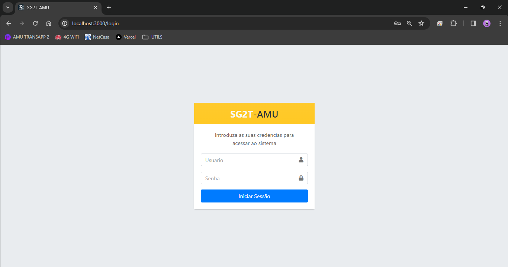
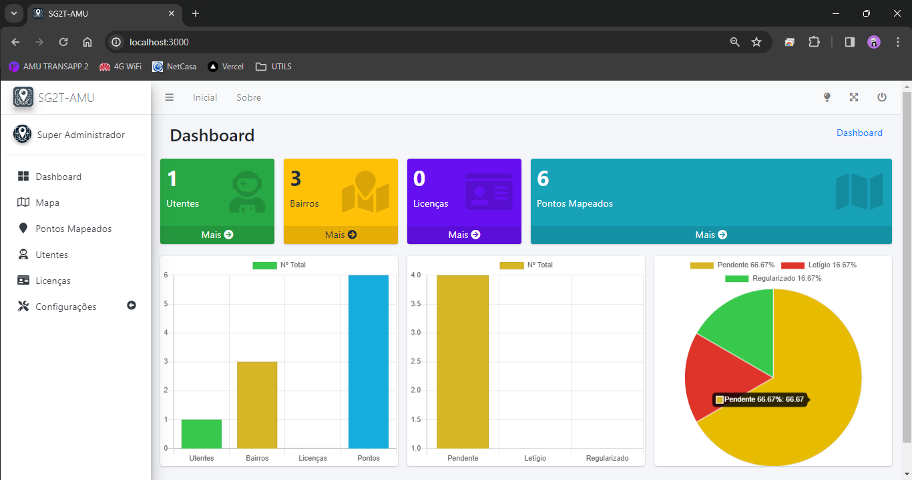
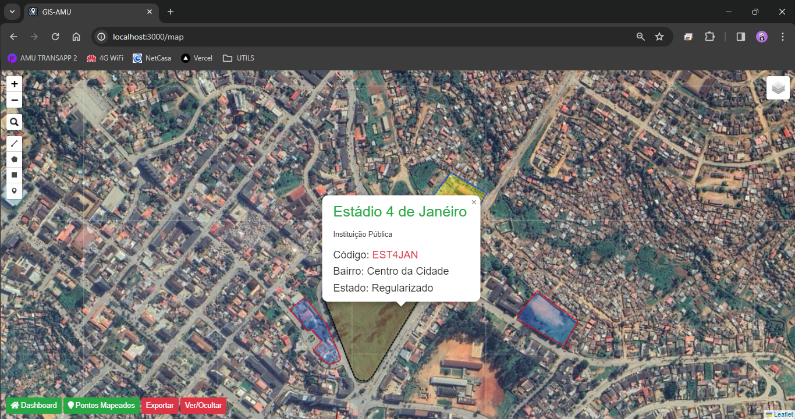
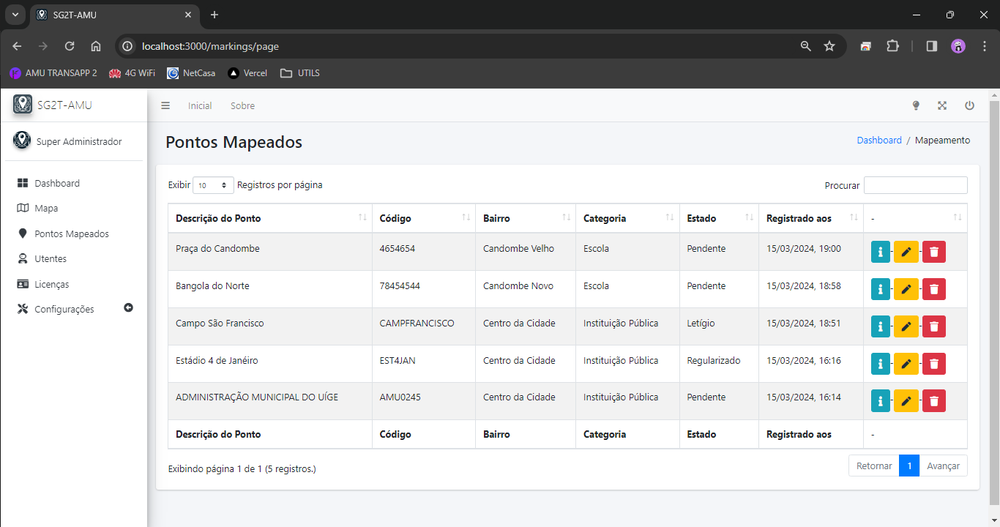
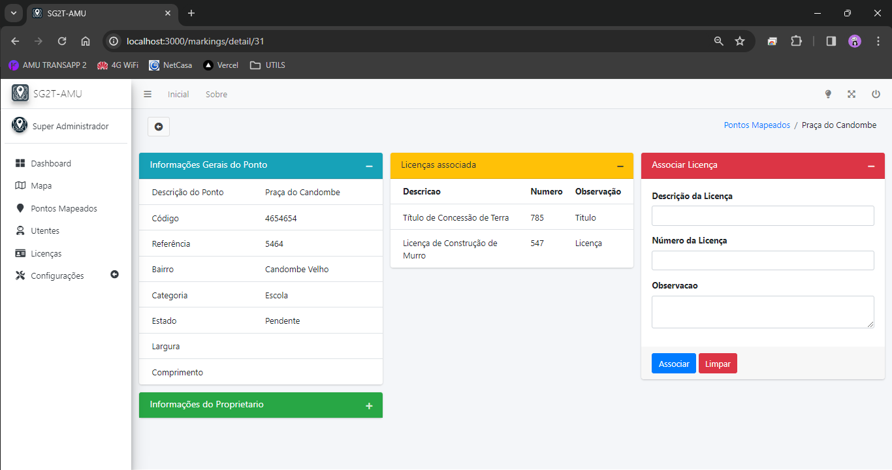
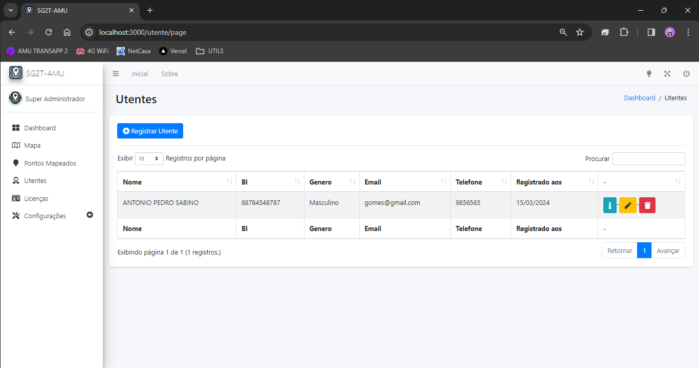

# Sistema de Geolocalização para Gerenciamento de Terrenos

O Sistema de Geolocalização para Gerenciamento de Terrenos (SG2T) é uma solução inovadora e eficiente para identificar e mapear propriedades em uma determinada localidade. Desenvolvido para atender às necessidades de empresas imobiliárias, órgãos governamentais, e proprietários individuais, o sistema oferece uma plataforma abrangente para o cadastro, visualização e gerenciamento de informações relacionadas a terrenos e seus respectivos proprietários.

## Acesse o Projeto em Funcionamento

O sistema está disponível online, permitindo que você o explore e experimente suas funcionalidades.[Clique aqui para acessar o projeto](https://projecto-mapa-prisma.vercel.app/).

## Tecnologias Utilizadas

O projeto é desenvolvido utilizando as seguintes tecnologias:

### Backend

- Node.js
- Express
- Prisma ORM
- SQLite (Banco de Dados Local para Desenvolvimento)
- PostgreSQL (Banco de Dados em Produção)

### Frontend

- Hbs (Handlebars) View Engine
- Leaflet.js
- Bootstrap
- AdminLTE
- DataTable

## Como Executar Localmente

1. Clone este repositório:

   ```bash
   git clone https://github.com/anvimaa/projecto-mapa-prisma.git
   ```

2. Instale as dependências e inicialize o PrismaClient:

   ```bash
   cd seu-diretorio
   npm install
   npx prisma migrate dev --name "Inicial"
   ```

3. Execute o aplicativo localmente:

   ```bash
   node server.js
   ```

4. Abra o navegador e acesse `http://localhost:3000` para visualizar o sistema em execução.

## Contribuições

Contribuições são bem-vindas! Sinta-se à vontade para abrir issues ou enviar pull requests para melhorar o projeto.

## Licença

Este projeto é licenciado sob a [Licença MIT](LICENSE). Sinta-se livre para utilizar, modificar e distribuir conforme necessário.

## Algumas capturas feitas no Sistema







